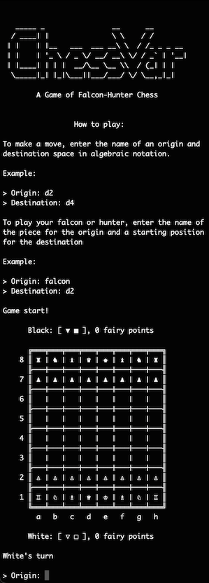

# falcon-hunter-chess

This repository contains a command line-based variation of chess that includes
two new "fairy" pieces: the Falcon and the Hunter. These pieces have additional
restrictions and special move sets that put a unique spin on classic chess.

This project aims to demonstrate programming fundamentals:

-   Object-oriented program design
-   User input validation
-   Game logic implementation
-   Error handling
-   Unit testing with Python's `unittest`



## Original project instructions:

Write a class named **ChessVar** for playing an abstract board game that is a
variant of chess. The following explanation of the rules assumes some
familiarity with the rules of chess - specifically how the pieces move and
capture. If you have any questions about those rules, please don't hesitate to
ask.

The starting position for the game is the normal starting position for standard
chess. You will need to keep track of which player's turn it is. As in standard
chess, white moves first. Pieces move and capture the same as in standard chess,
except that **there is no check or checkmate, and there is no castling, en
passant, or pawn promotion**. As in standard chess, each pawn should be able to
move two spaces forward on its first move (but not on subsequent moves).

If a player's king is captured, the game ends, and that player loses.

Locations on the board will be specified using "algebraic notation", with
columns labeled a-h and rows labeled 1-8, as shown in this diagram:


Special rules for this variant of chess:

Each of the players in the reserve has one piece of the **Falcon** and the
**Hunter**.

Falcon: moves forward like a bishop, and backward like a rook

Hunter: moves forward like a rook and backward like a bishop

The falcon and hunter start the game off the board and out of play (see
diagram). Once a player loses their queen, a rook, a bishop, or a knight, they
may, on any subsequent move, enter their falcon or hunter into play on any
**empty square of their two home ranks**. Doing so constitutes a turn. The
player becomes eligible to enter their remaining fairy piece (falcon or hunter)
after losing a second piece (queen, rook, bishop, or knight)(could be anytime
after losing the first piece, don’t need to be losing after entering the first
fairy piece). https://www.chess.com/blog/Pokshtya/falcon-hunter-chess
https://en.wikipedia.org/wiki/Falcon%E2%80%93hunter_chess

Your ChessVar class must include the following:

-   An **init method** that initializes any data members
-   A method called **get_game_state** that just returns 'UNFINISHED',
    'WHITE_WON', 'BLACK_WON'.
-   A method called **make_move** that takes two parameters - strings that
    represent the square moved from and the square moved to. For example,
    make_move('b2', 'b4'). If the square being moved from does not contain a
    piece belonging to the player whose turn it is, or if the indicated move is
    not legal, or if the game has already been won, then it should **just return
    False**. Otherwise it should make the indicated move, remove any captured
    piece, update the game state if necessary, update whose turn it is, and
    return True.
-   A method called **enter_fairy_piece** that takes two parameters - strings
    that represent the type of the piece (white falcon 'F', white hunter 'H',
    black falcon 'f', black hunter 'h') and the square it will enter. For
    example, enter_fairy_piece ('H', 'c1'). If the fairy piece is not allowed to
    enter this position at this turn for any reason, it should **just return
    False**. Otherwise it should enter the board at that position, update whose
    turn it is, and return True.

You're not required to have a function that prints the board, but you will
probably find it very useful for testing purposes.

Feel free to add whatever other classes, methods, or data members you want. All
data members of a class must be private. Every class should have an init method
that initializes all of the data members for that class.

Here's a very simple example of how the class could be used:

```
game = ChessVar()
move_result = game.make_move('c2', 'c4')
game.make_move('g7', 'g5')
state = game.get_game_state()
```

```
The file must be named: **ChessVar.py**
```
